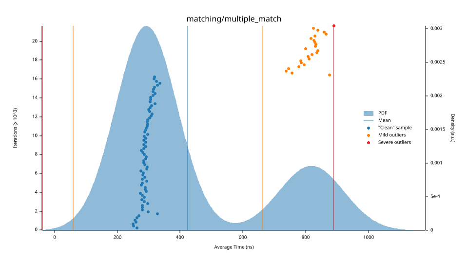
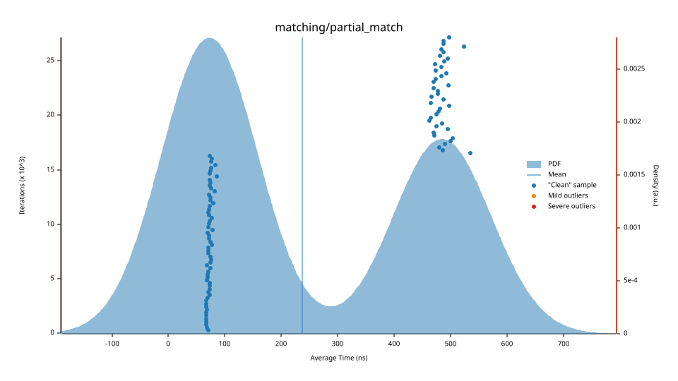
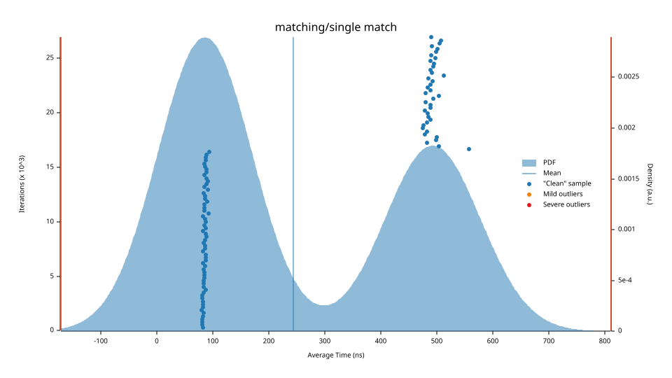

# 🚀 Orderbook / Matching Engine in Rust

A high-performance **Orderbook** with integrated **matching engine** built in **Rust** for **HFT (High-Frequency Trading)** environments. 
I can execute **millions of trades per second** on a single core.

The engine is designed with a strong focus on:

- ⚡ Ultra-low latency
- 🧠 Cache efficiency
- 🔒 Memory safety
- 📈 Deterministic performance

---

# ✨ Features

- 🔥 Zero-allocation hot path
- ⚡ O(1) matching & cancellation
- 🧩 Intrusive-style linked structures
- 🗂️ Cache-friendly slab allocator
- 🚄 Fast hashing using `FxHashMap`
- 📊 Built-in benchmark

---

# 📊 Benchmarks 🎯

Benchmarked with [Criterion.rs](https://github.com/bheisler/criterion.rs) in release mode (`cargo bench`).

## Highlights

| Benchmark | Latency | Change |
|---|---|---|
| Cancel order | ~9.39 µs | 🟢 -24.4% faster |
| Insert + cancel (first order) | ~11.14 µs | 🟢 -26.2% faster |
| Multiple match | ~602 ns | 🟢 -20.1% faster |
| Single / partial match | ~360-400 ns | ⚪ no significant change |
| Insert order (growing book) | ~177 µs | 🔴 regressed, under investigation |

> ⚠️ Note: `insert_order` in a growing orderbook regressed heavily in the latest run and is being profiled — likely candidates are price-level (BTreeMap) growth or slab reallocation.

### Key Graphs

<p align="center">
  
  
  
  
</p>

📄 Full benchmark report, all graphs, and detailed analysis → [`benches/README.md`](./benches/README.md)


# 🏗️ Architecture Overview

The matching engine minimizes allocations and maximizes cache locality to achieve predictable performance under heavy load.

## 🔹 Zero-Allocation Hot Path

Orders are stored inside a pre-allocated **Slab allocator**, avoiding heap allocations during the critical matching loop.

```text
Incoming Order
      │
      ▼
 Pre-allocated Slab
      │
      ▼
 Matching Engine
```

This keeps execution fast and deterministic.

---

## 🔹 Intrusive-Style Data Structures

Instead of heap pointers, orders use `usize` slab indices to form doubly-linked lists.

### Benefits

- Better cache locality
- Reduced pointer chasing
- Faster traversal
- Simpler memory management

```text
[Order #12] <--> [Order #27] <--> [Order #31]
     ↑               ↑                ↑
  slab idx        slab idx         slab idx
```

---

# ⚡ Performance Characteristics

| Operation | Complexity |
|---|---|
| Match head order | `O(1)` |
| Cancel order | `O(1)` |
| Append order | `O(1)` |
| Price lookup | `O(log P)` |

Where `P` is the number of active price levels.

---

# 🧠 Fast Cancellation Path

Order cancellation is optimized using:

```rust
FxHashMap<OrderId, SlabIndex>
```

This allows direct access to orders without scanning price levels.

---

# ⚙️ Core Components

## 📘 `OrderBook`

The central coordinator of the engine.

Maintains:

- `bids: BTreeMap<Price, PriceLevel>`
- `asks: BTreeMap<Price, PriceLevel>`

Each price level internally stores a linked list of orders.

---

## 📘 `Order`

Represents an individual order.

Contains:

- Order ID
- Price
- Quantity
- Side (Bid/Ask)
- Linked-list pointers (`prev`, `next`)

---

## 📘 `limit_order`

Primary entry point for incoming orders.

Automatically:

- Inserts liquidity
- Executes matching
- Routes to:
  - `match_buy`
  - `match_sell`

---

## 📘 `fill_at_price`

Internal matching routine responsible for:

- Trade execution
- Partial fills
- Removing fully filled orders

---

# 📊 Benchmark

The `main.rs` file includes a lightweight benchmark that:

1. Warms up the order book
2. Executes trades
3. Measures latency per trade

This demonstrates the engine’s performance-oriented design philosophy.

---

# 🛠️ Tech Stack

- 🦀 Rust
- 📦 `slab`
- ⚡ `rustc-hash`
- 🌳 `BTreeMap`

---

# 🎯 Design Goals

- Deterministic latency
- Minimal allocations
- Efficient memory usage
- HFT-ready architecture
- Simple & maintainable internals

---

# 🧪 Example

```rust
let mut book = OrderBook::new();

book.limit_order(Order {
    id: 1,
    price: 100,
    qty: 10,
    side: Side::Buy,
});
```

---

# 📌 Future Improvements

- [ ] Lock-free architecture
- [ ] SIMD optimizations
- [ ] Multi-threaded matching
- [ ] Persistent snapshots
- [ ] Market orders
- [ ] IOC/FOK order support
- [ ] Async networking layer

---

# 🏁 Conclusion

This project demonstrates how modern Rust techniques can be used to build a **low-latency**, **cache-efficient**, and **allocation-aware** matching engine suitable for high-frequency trading systems.